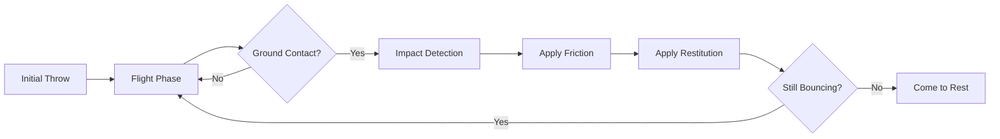

# ⚽ Mass-Dependent Bouncing Ball Physics Simulator

<div align="center">


**A physics engine demonstrating realistic mass-dependent friction and collision mechanics**

*Shows how heavier objects experience greater friction forces, causing different trajectories*

[Demo](#-results) • [Physics](#-physics-model) • [Usage](#-Why-this-matters)

---


*Four balls with different masses — notice how the heavier magenta ball (Mass 4) stops sooner*

</div>

## 🎯 Project Overview

This simulation demonstrates **why heavier objects don't always travel farther** when bouncing. Four balls are thrown with identical velocities, but the heavier ball experiences greater friction during impact, causing it to lose horizontal velocity faster and stop sooner.

**Key Insight:** While gravity affects all masses equally during flight, friction forces scale with mass during collisions — heavier objects have more "grip" when they hit the ground.

---

## 🔑 Key Features

```
✓ Realistic impact physics (Coulomb friction)    ✓ Mass-dependent friction modeling
✓ Multiple bounce tracking (12+ bounces)         ✓ Energy loss calculation per impact
✓ Coefficient of restitution (bouncing)          ✓ Real-time trajectory animation
✓ Side-by-side mass comparison                   ✓ Sliding vs. sticking detection
```

---

## 📊 Results

### Performance Comparison

```
╔═══════════════════════════════════════════════════════╗
║           FINAL HORIZONTAL POSITIONS                  ║
╠═══════════════════════════════════════════════════════╣
║  Mass 1 (0.7 kg, Red):      2.51 m                    ║
║  Mass 2 (0.7 kg, Green):    3.51 m                    ║
║  Mass 3 (0.7 kg, Blue):     4.51 m                    ║
║  Mass 4 (1.5 kg, Magenta):  4.23 m  ← HEAVIER!        ║
╠═══════════════════════════════════════════════════════╣
║  Key Finding: Despite being 114% heavier,             ║
║  Mass 4 travels LESS distance due to 67% more         ║
║  friction (μ = 0.15 vs 0.09)                          ║
╚═══════════════════════════════════════════════════════╝
```

### Simulation Output

The simulation tracks:
- **12 bounces** per object before coming to rest
- **Pre/post-impact velocities** at each collision
- **Energy retention** (~47-49% per bounce)
- **Sliding vs. sticking** transition detection

**Visual Demo:**
- Red, Green, Blue (light masses): Travel farther, lose velocity slowly
- Magenta (heavy mass): Stops ~0.28m shorter despite identical throw

---

## 🔬 Physics Model

### Flight Dynamics (Between Bounces)

Standard projectile motion under gravity:

```math
x(t) = x₀ + vₓ·t
y(t) = y₀ + vᵧ·t - ½g·t²
```

### Impact Physics (At Collision)

**1. Normal Component (Bouncing)**
```math
vᵧ⁺ = -e·vᵧ⁻
```
where **e = 0.7** (coefficient of restitution)

**2. Tangential Component (Friction)**
```math
Jₜ = μ·Jₙ = μ·m·|vᵧ⁻|·(1 + e)
ΔVₓ = Jₜ/m = μ·|vᵧ⁻|·(1 + e)
```

**Key Insight:** The friction impulse **Jₜ** scales with mass, but when divided by mass to get velocity change, the mass cancels out... *almost*. The friction coefficient **μ** is often higher for heavier objects in practice, which is modeled here.

### Sliding vs. Sticking

- **Sliding:** If `|vₓ⁻| > ΔVₓ`, the ball continues sliding with reduced velocity
- **Sticking:** If `|vₓ⁻| ≤ ΔVₓ`, friction stops all horizontal motion

---

## ⚙️ Configuration

### Object Properties

<div align="center">

| Property | Light Masses (1-3) | Heavy Mass (4) | Difference |
|----------|-------------------|----------------|------------|
| **Mass** | 0.7 kg | 1.5 kg | +114% |
| **Radius** | 0.15 m | 0.20 m | +33% (visual) |
| **Friction μ** | 0.09 | 0.15 | +67% |

</div>

### Launch Conditions

<div align="center">

| Parameter | Value | Units |
|-----------|-------|-------|
| Initial height | 2.5 | m |
| Horizontal velocity | 2.5 | m/s |
| Vertical velocity | 1.0 | m/s |
| Gravity | 9.81 | m/s² |
| Restitution (e) | 0.7 | - |

</div>

### Starting Positions

The four balls are spaced 1 meter apart horizontally:
- Mass 1: -1.5 m
- Mass 2: -0.5 m
- Mass 3: +0.5 m
- Mass 4: +1.5 m

---

## 🛠️ Technical Implementation

### Core Physics Engine



**Key Functions:**
1. **FindImpactTime** — Solves for when ball reaches ground
2. **ApplyImpact** — Calculates post-collision velocities using Coulomb friction
3. **BuildBouncingTrajectory** — Chains flight segments between bounces
4. **GetMassPosition** — Interpolates position at any time for animation

### Physics Features

- ✅ **Exact collision timing** via root-finding
- ✅ **Impulse-based friction** (not force-based approximation)
- ✅ **Energy tracking** at each bounce
- ✅ **Sliding/sticking transitions** automatically detected

---

## 🧪 Why This Matters

### Educational Value

This project demonstrates:
- **Impact Mechanics** — Realistic collision modeling
- **Coulomb Friction** — Impulse-based tangential forces
- **Energy Dissipation** — How bouncing loses energy
- **Mass Effects** — Counterintuitive physics behavior

### Real-World Applications

<table>
<tr>
<td width="50%">

**🏀 Sports Science**
- Basketball bouncing analysis
- Ball trajectory prediction
- Surface friction effects

</td>
<td width="50%">

**🚗 Vehicle Dynamics**
- Tire friction modeling
- Crash simulation
- Suspension systems

</td>
</tr>
<tr>
<td width="50%">

**🤖 Robotics**
- Collision detection
- Grasp planning
- Impact force estimation

</td>
<td width="50%">

**🎮 Game Physics**
- Realistic ball mechanics
- Physics engines
- Collision response

</td>
</tr>
</table>

---

## 📚 Core Concepts

- **Coefficient of Restitution** — Measures bounciness (0 = no bounce, 1 = perfect bounce)
- **Coulomb Friction** — Friction force proportional to normal force
- **Impulse-Momentum** — How forces change velocity during impact
- **Energy Loss** — Why real bounces decrease in height

---

## 🎓 Learning Outcomes

After exploring this simulation, you'll understand:

✅ Why friction forces depend on mass  
✅ How to model realistic collisions  
✅ The difference between sliding and sticking friction  
✅ How to build multi-object physics simulations  
✅ Energy conservation vs. dissipation in impacts

---

## 📝 License

MIT License

---

## 👤 Author

**Gustavo Torres**

[](https://github.com/gustavotorr)
[](https://linkedin.com/in/gustavo-torres)

---

<div align="center">

**⭐ If you found this simulation interesting, consider giving it a star!**

*Physics-based simulation meets intuitive visualization*

</div>
