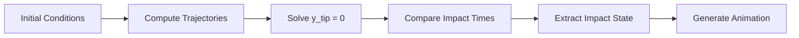

# 🌀 Rotating Link Projectile — Tip Impact Detection

<div align="center">


**A physics-based simulation modeling a rotating rigid link in projectile motion**

*Determines which end strikes the ground first, where it lands, and the complete kinematic state at impact*

[Features](#-key-features) • [Theory](#-physical-model) • [Results](#-results) • [Usage](#-how-to-run)

---

</div>

## 🎯 Project Overview

This project analyzes the motion of a rigid rod launched into the air with both **linear velocity** and **angular velocity**. As the center of mass follows a ballistic trajectory under gravity, the rod rotates continuously, causing each end to trace a complex helical path through space.

**The Challenge:** Determine which tip contacts the ground first in a system with coupled translational and rotational dynamics.

### What This Computes

- ⏱️ Time of first ground contact for each tip
- 🎯 Which tip impacts first
- 📍 Exact impact location
- 📊 Complete translational and rotational state at impact
- 🎬 Real-time interactive visualization

---

## 🧠 Problem Statement

This is a **hybrid kinematics and root-finding problem**: Given a rigid body undergoing simultaneous translation and rotation, determine which contact point reaches a boundary constraint first.

### Applications

<table>
<tr>
<td width="50%">

**🤖 Robotics**
- Collision detection algorithms
- Object manipulation planning
- Thrown object prediction

</td>
<td width="50%">

**🚀 Aerospace**
- Debris reentry modeling
- Tumbling stage analysis
- Impact trajectory prediction

</td>
</tr>
<tr>
<td width="50%">

**🎮 Physics Engines**
- Rigid body collision systems
- Realistic projectile motion
- Contact point detection

</td>
<td width="50%">

**🏗️ Engineering**
- Safety impact analysis
- Structural dynamics
- Falling object modeling

</td>
</tr>
</table>

---

## 🔑 Key Features

```
✓ Full rigid-body kinematics          ✓ Rotating reference frame analysis
✓ Analytical COM motion under gravity ✓ Exact impact detection via root-finding
✓ Tip-by-tip collision comparison     ✓ Interactive Mathematica animation
✓ Numerical state reporting           ✓ Real-time trajectory visualization
```

---

## 📐 Physical Model

### Center of Mass Dynamics

The center of mass follows standard projectile motion under constant gravitational acceleration:

```math
x(t) = x₀ + vₓ₀ · t
```

```math
y(t) = y₀ + vᵧ₀ · t - ½g · t²
```

### Rotational Kinematics

The link rotates with constant angular velocity:

```math
θ(t) = θ₀ + ω · t
```

### Tip Position Equations

The positions of tips A and B in the inertial frame are:

**Tip A** (leading end):
```math
xₐ(t) = x(t) + (L/2) · cos(θ(t))
```
```math
yₐ(t) = y(t) + (L/2) · sin(θ(t))
```

**Tip B** (trailing end):
```math
xᵦ(t) = x(t) - (L/2) · cos(θ(t))
```
```math
yᵦ(t) = y(t) - (L/2) · sin(θ(t))
```

### Impact Condition

Ground contact occurs when either tip reaches the ground plane (`y = 0`). The system solves:

```math
yₐ(t) = 0    or    yᵦ(t) = 0
```

using Mathematica's `FindRoot` numerical solver to obtain the impact time for each tip.

---

## ⚙️ Initial Conditions

<div align="center">

| Parameter | Symbol | Value | Units |
|-----------|--------|-------|-------|
| **Initial x-position** | x₀ | 0 | m |
| **Initial y-position** | y₀ | 18 | m |
| **Initial x-velocity** | vₓ₀ | 6 | m/s |
| **Initial y-velocity** | vᵧ₀ | 20 | m/s |
| **Gravitational acceleration** | g | 9.81 | m/s² |
| **Link length** | L | 20 | m |
| **Initial angle** | θ₀ | π/2 | rad |
| **Angular velocity** | ω | 0.9π | rad/s |

</div>

---

## 📊 Results

<div align="center">


https://github.com/user-attachments/assets/4af4847c-ee67-41d3-81ef-741fe2b7693d


### 🎯 Impact Summary

</div>

```
╔════════════════════════════════════════════════════╗
║              FIRST CONTACT: TIP B                  ║
╠════════════════════════════════════════════════════╣
║  Impact Time:          t = 4.444 s                 ║
║  Impact Position:      x = 26.67 m                 ║
║  Impact Angle:         θ = 14.14 rad ≈ 4.50π       ║
╠════════════════════════════════════════════════════╣
║  KINEMATIC STATE AT IMPACT                         ║
╠════════════════════════════════════════════════════╣
║  Horizontal Velocity:  ẋ = 6.00 m/s     →          ║
║  Vertical Velocity:    ẏ = -23.6 m/s    ↓          ║
║  Angular Velocity:     θ̇ = 2.83 rad/s   ↻          ║
╚════════════════════════════════════════════════════╝
```

**Physical Interpretation:** Tip B strikes the ground first because the rotation causes it to sweep downward faster than the COM's ballistic descent, while Tip A is carried upward by the rotation.

---

## 🎞️ Animation System

The simulation includes a **real-time interactive visualization** built with Mathematica's `Manipulate` function:

### Visualization Elements

- 🟢 **Green Point** — Tip A position
- 🔴 **Red Point** — Tip B position  
- ⚫ **Black Point** — Center of mass
- ⚪ **White Line** — Rigid link body
- 🟡 **Yellow Dashed Curve** — COM trajectory history
- 📍 **Impact Marker** — Persistent ground contact point

### Interactive Controls

Time can be scrubbed interactively using an animator slider spanning `t ∈ [0, 5.5]` seconds with 0.01s resolution.

---

## 🛠️ Technical Implementation

### Core Methods

| Component | Technique |
|-----------|-----------|
| **Kinematics** | Analytical equations of motion |
| **Impact Detection** | Numerical root-finding (`FindRoot`) |
| **Tip Comparison** | Conditional logic with time ordering |
| **Visualization** | Parametric plotting + dynamic graphics |
| **Animation** | `Manipulate` with temporal interpolation |

### Computational Workflow



---

## 🧪 Why This Matters

This project demonstrates:

- ✅ **Computational Rigid-Body Physics** — Coupled translation and rotation
- ✅ **Numerical Methods** — Root-finding for transcendental equations  
- ✅ **Rotating Reference Frames** — Coordinate transformations
- ✅ **Impact State Extraction** — Full kinematic analysis at collision
- ✅ **Scientific Visualization** — Real-time interactive graphics

These techniques are foundational in **robotics**, **aerospace engineering**, **physics engines**, and **computational mechanics**.

---

## 📋 Requirements

- **Wolfram Mathematica** 12.0 or later
- No additional packages required (uses built-in functions)

---

## 📝 License

MIT License — Free to use, modify, and distribute.

---

## 👤 Author

**Gustavo Torres**

[](https://github.com/gustavotorr)
[](https://linkedin.com/in/gustavo-torres)

---

<div align="center">

**⭐ If you found this project interesting, consider giving it a star!**

*Built with precision, powered by physics*

</div>
